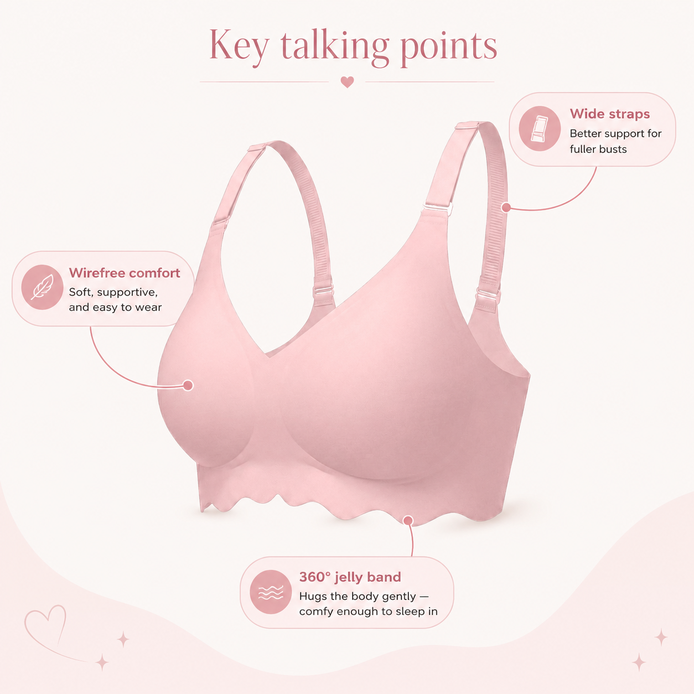
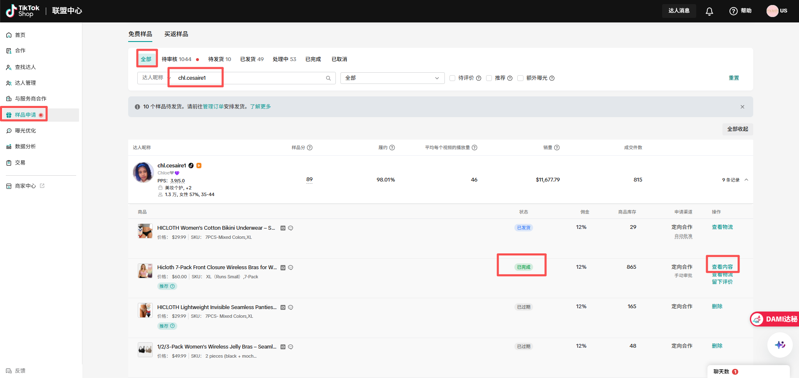

# 查看到货信息以及跟进达人视频

对应飞书：[查看到货信息以及跟进达人视频](https://rsed6zggjt.feishu.cn/wiki/TUIvwibISiZBJ3kzdEac4Kssnbh)

## 项目约定（以本文件 + 业务员补充为准）

飞书 wiki 正文里仍可能出现旧日历（到货第五天、每隔两天）和 B006-A。**跟进日历、配图商品、未履约**以本节和业务员说明为准，忽略 B006-A。飞书文档 2026-08-26 更新：底部新增「跟进情况时在【全部】中搜索指定达人…【处理中】代表样品已经到货需要在以下几天给达人发送私信：到货当天 / 到货后第三天 / 到货后第七天」，与本节日历一致。

- 人工查某人：样品申请 → **【全部】** 搜达人名（物流状态不确定时不要只翻一个状态 tab），再点【查看物流】。
- 自动化每日池：只扫 **免费样品** 的 **【处理中】**（API `tab=40`，`curr_status=40`）。【处理中】= 样品已到货。
- **买返样品** 是另一套页签（待发货 / 已发货 / 处理中 / 已退款 / 未退款），现有样品列表 API 点了买返也不会切换。V1 不跟买返。
- 页面角标人数往往按 **申请条数**（`apply_count` 求和），列表 API `total_count` 按 **达人组**。不要用角标和 API 总数一对一验收。
- 物流：订单页 GET `/api/v1/fulfillment/na/logistic_detail/list`。状态看 `track_list[0].title`（英文 `Delivered` = 已送达）。没有 `delivered_at` 键；D0 用该条 `time`（unix 秒）的北京自然日。禁止把 ETA（`predict_delivery_time_text`）当送达。
- **【已发货】** = 在途，不是到货。
- **跟进不分商品**：B005 与非 B005 都要跟进，话术只差「刚到货」一档——B005 刚到货附图（讲解图），非 B005 刚到货只发话术不配图；3 天 / 7 天 / 出名单 / 未履约的话术通用。批准当前仍只过商品 ID `1732414717062320994`（B005 且主推=是），恢复全部主推：筛查加 `--all-hero-products`。
- 语言：先读飞书「达人关系管理(新)」**使用语言**（英语 / 西班牙语）。无值再走达人详情简介 `detect_creator_lang`（空简介默认英语、低置信）。
- 话术区分英语/西班牙语、视频达人/直播达人。视频+直播同时标记 → 人工确认，不拆两条自动发送。

## 跟进节奏（处理中）

到货日 = 物流最新事件 title=`Delivered` 的北京自然日（D0）。

| 时点 | 动作 |
|------|------|
| 到货当天 D0 | 发到货话术（B005 附讲解图；非 B005 只发话术） |
| 到货后第 3 天 | 发「3 天未出视频」话术 |
| 到货后第 7 天 | 发「7 天未出视频」话术 |
| 到货后第 10 天仍未发视频 | **只出名单**给业务员，不自动发信 |
| 到货后第 15 天仍未发视频 | 平台会进【已取消】；飞书合作状态改为 **未发布**（业务含义=未履约；勿写成「待发布」）。须 `--write-feishu`；V1 操作台默认不写 |
| 达人发视频 / 开直播 | 平台进【已完成】；发下方感谢话术（不增删原文）；飞书合作状态改为 **已完成**（写飞书另加开关） |

不要补发错过的旧阶段，只显示当前最新该做的一步。V1 不自动扫 TikTok.com、不用达人精灵。内容证据由业务员确认后再走已完成话术和飞书「已完成」。

# 一. 打开【样品申请】界面，点击【全部】，在输入框输入想查询的达人名，搜索出来后点击【查看物流】

# 二. 点击【查看物流】

# 查看预计送达时间以及物流状态，例如【待揽收】/【已送达】

# 以下话术都需要区分语言和视频达人/直播达人

# 刚到货：仅指定 B005 配图

指定商品：货号 **B005**，是否主推=是，商品 ID **`1732414717062320994`**。

## 如果是该 B005，发送话术 + 图片：

## 视频达人（英语）：

Hi （达人名）! ❤️

I just wanted to check in and see if you’ve received the product yet. 😊

We recently started running automatic ad boosting for content featuring this product. If you could add **#Hicloth** when posting your video, it will help our system recognize your content more accurately and give your video more opportunities to reach the right audience. ✨

We’ve also prepared a product selling points image for you. Feel free to use it as a reference when creating your content and highlight some of the key features in your video, which can help your audience better understand the product and its benefits. 💕

If you have any questions or need any support, please feel free to reach out to me anytime. I’m always happy to help! 🥰

## 视频达人（西语）：

Hola（达人名） ! ❤️

Solo quería pasar por aquí para confirmar si ya recibiste el producto. 😊

Recientemente hemos comenzado a utilizar publicidad automática para impulsar los videos relacionados con este producto. Si puedes añadir **#Hicloth** al publicar tu video, ayudará a que nuestro sistema identifique tu contenido con mayor precisión y le dará más oportunidades de llegar a la audiencia adecuada. ✨

También hemos preparado una imagen con los puntos de venta principales del producto para ti. Puedes utilizarla como referencia al crear tu contenido y mencionar algunas de estas características en tu video, lo que ayudará a que tu audiencia conozca mejor el producto y sus beneficios. 💕

Si tienes cualquier pregunta o necesitas ayuda, no dudes en contactarme en cualquier momento. ¡Estaré encantada de ayudarte! 🥰

## 直播达人（英语）：

Hi （达人名）❤️

Just checking in to see if you’ve received the product yet! 😊 We really love your live streams and would love to build a long-term partnership with you. ✨

For great-fit creators, we can offer exclusive live flash sales and extra support to help boost traffic and sales. 🚀

We’ve also prepared a product selling-points image for your reference during your live. If you need any help, feel free to reach out anytime! 🥰

## 直播达人（西语）：

¡Hola （达人名）! ❤️

Solo quería saber si ya recibiste el producto. 😊 Nos encantan tus transmisiones en vivo y nos gustaría mucho trabajar contigo a largo plazo. ✨

Para los creadores que encajan bien con nuestra marca, podemos ofrecer promociones exclusivas durante los lives y apoyo adicional para ayudarte a aumentar el tráfico y las ventas. 🚀

También preparamos una imagen con los puntos clave del producto para que puedas usarla como referencia durante tu live. Si necesitas cualquier ayuda, ¡no dudes en escribirme! 🥰

## 如果不是该 B005（其它货号，同样要跟进；刚到货不配图，3 天 / 7 天话术与 B005 通用）：

## 视频达人（英语）：

Hi （达人名）! ❤️

I just wanted to check in and see if you’ve received the product yet. 😊 We’re so excited to see your content and can’t wait to see how you style and share it with your audience!

We recently started running automatic ad boosting for videos featuring this product, so if you could add **#Hicloth** when posting, it can help your content get discovered by more of the right audience and bring more exposure to your video. ✨

If you have any questions about the product, content ideas, or need any support from our side, please feel free to reach out anytime. We’re always happy to help! 💕

## 视频达人（西语）：

Hola（达人名）! ❤️

Solo quería pasar por aquí para confirmar si ya recibiste el producto. 😊 ¡Estamos muy emocionados de ver tu contenido y nos encantaría ver cómo lo muestras y compartes con tu audiencia!

Recientemente hemos comenzado a impulsar automáticamente los videos relacionados con este producto mediante publicidad, así que si puedes añadir el hashtag **#Hicloth** al publicar tu video, ayudará a que tu contenido pueda llegar a una audiencia más adecuada y obtener más exposición. ✨

Si tienes cualquier pregunta sobre el producto, necesitas ideas para tu contenido o cualquier tipo de ayuda por nuestra parte, no dudes en escribirme cuando quieras. ¡Estaremos encantados de apoyarte! 💕

## 直播达人（英语）：

Hi （达人名）! ❤️

I just wanted to check in and see if you’ve received the product safely. 😊

We’re excited to have the opportunity to work with you! For creators who enjoy going live, we can provide exclusive live flash sale events and additional support to help you create a better shopping experience for your audience and maximize your results. ✨

If you have any upcoming live plans or there’s anything you need from our side (product details, content ideas, promotions, etc.), please don’t hesitate to reach out anytime. I’ll do my best to support and coordinate everything for you! 💕

Can’t wait to see your content and hopefully work together more! 🥰

## 直播达人（西语）：

Hola（达人名）! ❤️

Solo quería pasar por aquí para confirmar si ya recibiste el producto correctamente. 😊

¡Estamos muy emocionados de tener la oportunidad de colaborar contigo! Para las creadoras que disfrutan hacer transmisiones en vivo, podemos ofrecer campañas exclusivas de descuentos en tus lives y apoyo adicional para ayudarte a crear una mejor experiencia de compra para tu audiencia y obtener mejores resultados. ✨

Si tienes algún plan de hacer un live próximamente o necesitas cualquier ayuda de nuestra parte (información del producto, ideas de contenido, promociones, etc.), no dudes en escribirme cuando quieras. Haré todo lo posible para apoyarte y coordinar todo contigo. 💕

¡Tenemos muchas ganas de ver tu contenido y seguir colaborando contigo! 🥰

# 到货 3 天未出视频，发送话术：

## 视频达人（英语）：

Hi（达人名） ! ❤️

Just a friendly reminder that our product is currently running a limited-time promotion. ✨

We’re excited to see your video after trying the product! If you have any questions or need any help while creating your content, feel free to reach out anytime. 😊

## 视频达人（西语）：

Hola（达人名）! ❤️

Solo quería recordarte que el producto con el que estamos colaborando tiene una promoción especial por tiempo limitado. ✨

¡Tenemos muchas ganas de ver tu video después de probar el producto! Si tienes cualquier pregunta o necesitas ayuda durante la creación de tu contenido, no dudes en escribirme. 😊

## 直播达人（英语）：

Hi （达人名）! ❤️

Just a friendly reminder that the product we’re collaborating on is currently running a limited-time promotion. ✨

We’re really looking forward to seeing you showcase and test the product during your next live stream! If you need any help during your live session, please feel free to contact me anytime. 😊

We’d be happy to support you and look forward to having a great collaboration together! 💕

## 直播达人（西语）：

Hola（达人名）! ❤️

Solo quería recordarte que el producto con el que estamos colaborando actualmente tiene una promoción especial por tiempo limitado. ✨

¡Tenemos muchas ganas de verte probar el producto en tu próximo live! Si necesitas cualquier ayuda durante tu transmisión, no dudes en contactarme en cualquier momento. 😊

¡Estaremos encantados de apoyarte y esperamos tener una excelente colaboración contigo! 💕

# 到货 7 天未出视频，发送话术：

## 视频达人（英语）：

Hi （达人名）! ❤️

We’re currently running a creator video promotion campaign this week, and we’d love to include your content in it! ✨

If you’re able to share your video soon, we can add it to our advertising campaign to help increase its exposure and bring more traffic to your content. 🚀

We’re excited to see your creation and can’t wait to support your video! 😊

## 视频达人（西语）：

Hola （达人名）! ❤️

Esta semana estamos realizando una campaña de promoción de videos de creadores y nos encantaría incluir tu contenido en ella. ✨

Si puedes publicar tu video pronto, podremos añadirlo a nuestra campaña de publicidad para ayudarte a aumentar la exposición de tu contenido y atraer más tráfico a tu video. 🚀

¡Tenemos muchas ganas de ver tu creación y apoyarte para que tu video tenga mejores resultados! 😊

## 直播达人（英语）：

Hi （达人名）! ❤️

I wanted to check if you have any upcoming live plans. 😊

We’ve noticed that this product has been getting great exposure and attention recently, so we were thinking this could be a great time to go live and take advantage of the current traffic. ✨

With the product’s strong momentum and your amazing ability to connect with and recommend products to your audience, we believe it could bring great results together. 🚀

If you’d like, we can also set up an exclusive live flash sale event for you to help boost your sales. And if there’s anything you need support with before or during your live stream, please feel free to let me know anytime. I’ll do my best to help! 💕

## 直播达人（西语）：

Hola（达人名）! ❤️

Quería preguntarte si tienes algún plan de hacer un live próximamente. 😊

Hemos notado que este producto ha estado recibiendo muy buena exposición y atención últimamente, así que creemos que podría ser un buen momento para aprovechar el tráfico actual y hacer una transmisión en vivo. ✨

Con el buen rendimiento del producto y tu gran capacidad para conectar con tu audiencia y recomendar productos, creemos que juntos podríamos conseguir muy buenos resultados. 🚀

Si te interesa, también podemos ayudarte a configurar una campaña exclusiva de descuento para tu live y así impulsar tus ventas. Además, si necesitas cualquier apoyo antes o durante tu transmisión, no dudes en escribirme en cualquier momento. ¡Haré todo lo posible por ayudarte! 💕

# 到货后第 10 天还未发布视频：发给业务员名单，不自动私信

# 到货后第 15 天还未发布视频：平台【已取消】；飞书合作状态改为【未发布】（未履约）

# 达人出视频，发送话术（平台【已完成】）：

## 视频达人（英语）：

Hi （达人名）! ❤️

We just saw the video you created for us and really appreciate your support and effort in showcasing our brand. Thank you so much! 🥰We love your content style and creativity. Would you be interested in creating 1–2 more videos for this product? ✨

We’d also love to add your videos to our advertising campaign and provide boosting support to help more people discover your content. 🚀We truly appreciate your creativity and would love to explore a long-term partnership with you! 💕

（视频链接）

## 视频达人（西语）：

Hola（达人名）! ❤️

Acabamos de ver el video que creaste para nosotros y realmente apreciamos mucho tu apoyo y el esfuerzo que pusiste en mostrar nuestra marca. ¡Muchas gracias! 🥰Nos encanta tu estilo de contenido y tu creatividad. ¿Te interesaría crear 1–2 videos más para este producto? ✨

También nos gustaría incluir tus videos en nuestra campaña de publicidad y brindar apoyo de promoción para ayudar a que más personas descubran tu contenido. 🚀Valoramos mucho tu creatividad y nos encantaría explorar una colaboración a largo plazo contigo. 💕

（视频链接）

# 达人开启直播：

# 搜索达人名后点击【查看内容】，只有合作状态变成【已完成】后才能查看视频/直播

## 英语：

Hi （达人名）! ❤️

We noticed your recent live stream and wanted to sincerely thank you for all the effort and support you’ve put into promoting our brand. We truly appreciate it! 🥰

We also saw that your live performance had great results, so we specially requested an exclusive live flash sale event for you. We hope this can help attract more customers, boost your sales, and bring you even more orders. 🚀

Would you be interested in featuring this product again in your upcoming live streams? We’d love to continue supporting you with more resources and work together to achieve even better results! ✨

## 西语：

Hola （达人名）! ❤️

Hemos visto tu reciente transmisión en vivo y queremos agradecerte sinceramente por todo el esfuerzo y apoyo que has dedicado a promocionar nuestra marca. ¡Lo apreciamos muchísimo! 🥰

También notamos que tu live tuvo muy buenos resultados, por eso solicitamos especialmente una campaña exclusiva de descuento para tu transmisión. Esperamos que esto pueda ayudarte a atraer más clientes, aumentar tus ventas y generar aún más pedidos. 🚀

¿Te gustaría seguir mostrando y promocionando este producto en tus próximos lives? Nos encantaría seguir apoyándote con más recursos y trabajar juntas para conseguir resultados aún mejores. ✨

# 达人发布视频后需要将[内部达人建联记录表](https://rsed6zggjt.feishu.cn/base/CJXSbLIQWahB8esVOiscX7j1nLc?from=from_copylink)中对应合作状态修改为【已完成】

到货第 15 天仍无内容时，同一张表「合作状态」改为【未发布】（业务=未履约；不是「待发布」）。
