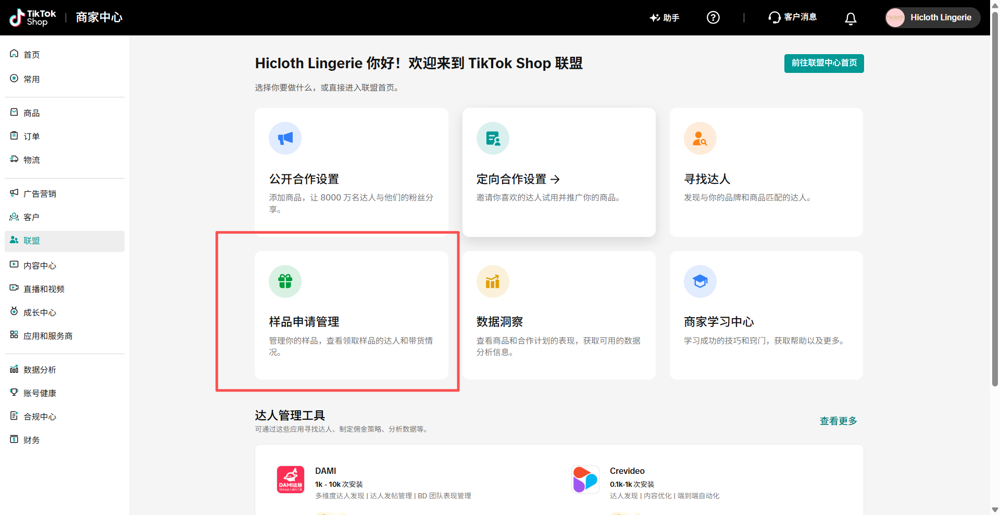

# 样品申请筛查sop

# 第一步：进入联盟中心

# 第二步：进入【样品申请管理】

# 第三步：点击【待审核】

# 第四步：逐一点开达人数据主页

# **筛选条件 1：**

## 1\.粉丝数（达人名字下面）：＞2000

## 2\.GMV：＞1k5

## 3\.成交件数：＞80

## 4\.千次曝光成交金额：＞10

## 5\.客单价：10\-25＄

## 6\.【按商品类目查看GMV（饼状图）】需要包含类目：

- Beauty \& Personal Care

- Womenswear \& Underwear

- Household Appliances

- Fashion Accessories

- Shoes

- Sports \& Outdoor

- **Home Textiles** 

## 7\.预计发布率：＞80%

## 8\.粉丝性别占比：女性＞60%

# 视频或者直播数据其中一个满足条件即可：

## 9\.视频GPM：＞10＄                      9\.直播GPM：＞12＄ 

## 10\.平均视频播放量：＞300            10\.平均直播播放量：＞1000

## 11\.视频平均互动率：＞2%    11.直播平均互动率：无要求         

# ** 筛选条件2：**

## 申请的样本必须是 [tk产品图\+货号](https://rsed6zggjt.feishu.cn/wiki/Bw0cwepLyiivGjkJH5IcVknJnQc?from=from_copylink) 里的“主推款”（是否主推=是）

## 找到都满足条件的达人后进入第五步

# 第五步：记录达人信息，点击同意样品申请，并同步到表格

同步到 [内部达人建联记录表](https://rsed6zggjt.feishu.cn/base/CJXSbLIQWahB8esVOiscX7j1nLc?from=from_copylink)

- **默认**：只导出名单，**禁止**脚本执行「同意」。
- **可选危险路径**（须显式参数，见 `AGENTS.md` / CLI）：`--execute --yes` 可对通过筛查的申请点「同意」；测试环境默认 **不写飞书**，写飞书须再加 `--write-feishu`。
- 默认 `--execute-limit 1`；批准成功后再写「达人关系管理(新)」；去重键为红人ID+寄样产品。

xlsx 格式 + csv 格式（同时）

需要记录信息：

1\.达人名(网页中可能有多个类似的字段，如果你不确定，可以问我)

2\.产品货号 [tk产品图\+货号](https://rsed6zggjt.feishu.cn/wiki/Bw0cwepLyiivGjkJH5IcVknJnQc?from=from_copylink) （从这个飞书表格里对比获取）

3\.履约率 （网页内如果没有「履约率」，那么应该是「合作指标」-「预计发布率」）

4\.成交件数（「销量」-「成交件数」）

5\.GPM（「视频数据」-「视频 GPM」，「直播数据」-「直播 GPM」，两个 GPM 都需要记录）

6\.视频达人/直播达人（应该是选择）

7\.粉丝数

# 第六步：打开达人私信界面，发送话术

英文

Hi  , thanks for requesting our lingerie sample! We’re excited to work with you.

To better coordinate the shipping and discuss the creative direction for the content, could you please share your WhatsApp or Gmail?

Once the tracking number is available, I will send it to you right away.

西语

Hola , ¡gracias por solicitar nuestra muestra de lencería!

Estamos muy emocionados de trabajar contigo. Para coordinar mejor el envío y hablar sobre la dirección creativa del contenido, ¿podrías compartirme tu WhatsApp o Gmail?

Además, querida, ¿estarías abierta a hacer transmisiones en vivo de nuestros productos? En cuanto tenga el número de seguimiento, te lo envío inmediatamente.

# 第七步：北京时间下午四点后点击【样品申请】--【已发货】--【查看物流】

# 第八步：复制订单号、物流单号到【内部达人建联表】，填进下图2中红标中（要打勾）

# 第九步：复制对应达人的物流单号打开私信发送给达人

发给达人的是商家订单页 **「TikTok 物流」单号**（如 `UUS68…` / `9200…` / `1LSD…`），**不是**「订单 ID」。下图示例误把订单号贴进了话术，以本文为准。

话术后接物流单号

英语：Dear, here is the tracking number:

西语：Estimada, aquí tienes el número seguimiento:

示例图如下：

